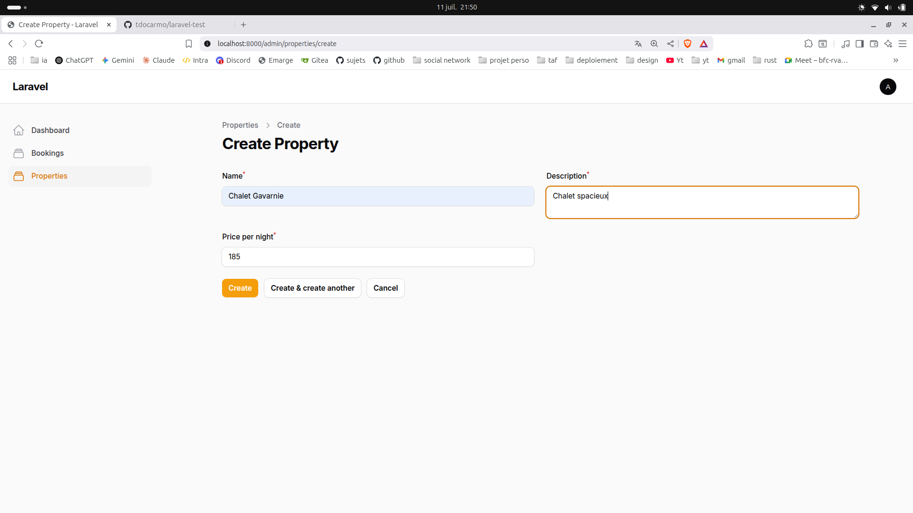

# Application de gestion de réservations immobilières

## Sommaire

-   [Fonctionnalités](#fonctionnalités)
-   [Installation](#installation)
-   [Utilisation](#utilisation)
-   [Stack technique](#stack-technique)
-   [Captures d’écran](#captures-décran)
-   [Auteur](#auteur)

## Fonctionnalités

-   Création de compte, connexion et déconnexion ([Laravel Breeze](https://laravel.com/docs/12.x/starter-kits#laravel-breeze))
-   Gestion des propriétés et réservations (CRUD)
-   Interface utilisateur responsive (Blade + [TailwindCSS](https://tailwindcss.com/))
-   Composant [Livewire](https://laravel-livewire.com/) pour la réservation de biens
-   Panneau d’administration [Filament](https://filamentphp.com/) sécurisé (accès admin uniquement)
-   Relations utilisateurs/propriétés/réservations gérées

## Installation

1. **Cloner le repo** :
    ```sh
    git clone <url-du-repo>
    cd laravel-test
    ```
2. **Installer les dépendances** :
    ```sh
    composer install
    npm install && npm run build
    ```
3. **Configurer** le fichier `.env` et la base de données.
4. **Lancer les migrations** :
    ```sh
    php artisan migrate
    ```
5. **Créer un utilisateur admin** :
    ```sh
    php artisan tinker
    >>> \App\Models\User::create(['name'=>'admin','email'=>'admin@admin.com','password'=>bcrypt('testtest'),'is_admin'=>true]);
    ```

## Utilisation

-   Accès public : [`/`](http://localhost:8000/) (inscription, connexion, réservation)
-   Accès admin : [`/admin`](http://localhost:8000/admin) (`admin@admin.com` / `testtest`)
-   L’admin peut gérer toutes les propriétés et réservations via le dashboard Filament.

## Stack technique

-   [Laravel 12](https://laravel.com/)
-   [Breeze](https://laravel.com/docs/12.x/starter-kits#laravel-breeze)
-   [Livewire](https://laravel-livewire.com/)
-   [Filament](https://filamentphp.com/)
-   [TailwindCSS](https://tailwindcss.com/)

## Captures d'écran

### Interface utilisateur

**Page d'accueil admin**


**Inscription utilisateur**


**Connexion utilisateur**


**Connexion admin**


**Déconnexion**


**Réservation utilisateur**


**Accès bloqué pour non-admin**


### Interface d'administration (Filament)

**Gestion des propriétés**


**Création de propriété**


**Gestion des réservations**


**Création de réservation**


_Note : Les captures d'écran sont stockées dans le dossier `~/Images/Captures d'écran/`_

## Auteur

Toni Do Carmo
11 juillet 2025
